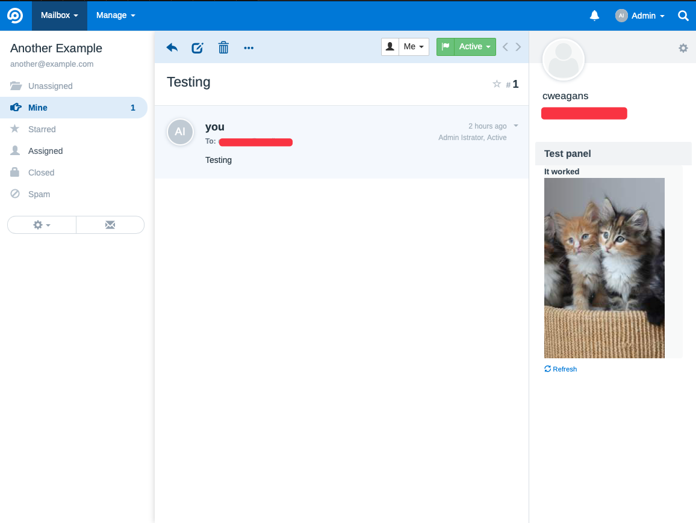
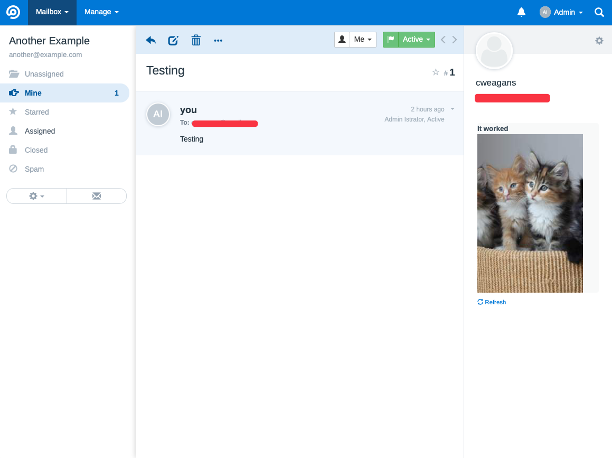

# Caseproof FreeScout Sidebar Webhook

This is a fork of the Free Sidebar Webhook project.

## Javascript execution

It enhances it adding the ability to execute javascript code contained in the webhook server response, 
which would be otherwise prevented due to the CSP imposed by Freescout. 

The only thing you need to do is to add a `{{nonce}}` placeholder to the `script` tags that need to be executed. E.g.:
```html
<script {{nonce}}>
...
</script>
``` 

## Custom Modules building

Steps to create a custom module.
1) Require this project via composer.
2) Add a `module.json` that describes your module, like:
```json
{
    "name": "Custom Sidebar Webhook",
    "alias": "customsidebarwebhook",
    "description": "Custom Sidebar Webhook asynchronously injects HTML from your server into conversation sidebars.",
    "version": "1.0.0",
    "detailsUrl": "https://github.com/caseproof/custom-sidebar-webhook",
    "author": "Caseproof Developers",
    "providers": [
        "Modules\\CustomSidebarWebhook\\Providers\\CustomSidebarWebhookServiceProvider"
    ],
    "requires": [],
    "files": [
        "start.php"
    ]
}
```
3) Add the following shortcut scripts to the scripts object in composer.json:
```json
    "scripts": {
        "post-install-cmd": [
            "./vendor/bin/build-custom-module"
        ],
        "post-update-cmd": [
            "./vendor/bin/build-custom-module"
        ]
    }
```
4) Run `composer install`.
5) Proceed to copy the content of the folder into your server module following the steps of the FreeScout Sidebar Webhook described in the Installation section below.
As per [Freescout documentation](https://gdoc.pub/doc/e/2PACX-1vSLbWqFvwlTvr_akQ9hu52-TfRJ9J-0HhpMuuvxHq5ch9qkI6HoGat8Y2mDxyMTasFX2ijSybNFCkBx):

> - Module folder name must be in a singular form (for example, TelegramNotification), it never changes and must be unique.
> - Module alias in module.json is the identifier of the module, it must be equal to the module folder name, lowercase, it never changes and must be unique, no spaces allowed.

Note that the module namespace must be in the form `Modules\\{ModuleFolderName}`.


# FreeScout Sidebar Webhook
Sidebar Webhook asynchronously injects HTML from your server into conversation sidebars.

This screenshot shows what it does: you can load any content on a per-customer, per-message basis from your own web server, asynchronously, every time a conversation is loaded on the screen.

In this picture, the kittens and text were loaded from an external server based on the customer's email address.




## Use cases

- Directly link to your customer management system
- Show details about order status live from your fulfillment system
- Quickly ship changes to your FreeScout system UI without updating modules
- Connect to backends using PHP/Node.js/Ruby/Perl/Rust/Go/Bash/Haskell and even Java

## Installation

These instructions assume you installed FreeScout using the [recommended process](https://github.com/freescout-helpdesk/freescout/wiki/Installation-Guide), the "one-click install" or the "interactive installation bash-script", and you are viewing this page using a macOS or Ubuntu system.

Other installations are possible, but not supported here.

1. Download the [latest release of FreeScout Sidebar Webhook](https://github.com/fulldecent/freescout-sidebar-webhook/releases).
2. Unzip the file locally.
3. Copy the folder into your server using SFTP. (ℹ️ Folder is renamed in this process.)
   ```sh
   scp -r ~/Downloads/freescout-sidebar-webhook root@freescout.example.com:/var/www/html/Modules/SidebarWebhook/
   ```
4. SSH into the server and update permissions on that folder. 
   ```sh
   chown -r www-data:www-data /var/www/html/Modules/SidebarWebhook/
   ```
5. Access your admin modules page like https://freescout.example.com/modules/list.
6. Find **Sidebar Webhook** and click ACTIVATE.
7. Configure the webhook URL in the mailbox settings. The webhook secret is optional and will be sent as part of the payload if set.
8. After everything works, purchase a license code by sending USD 10 at https://www.paypal.com/paypalme/fulldecent/10usd

## Your webhook server

Your webhook server will receive a POST request with this kind of JSON body:
```json
{
    "conversationSubject": "Testing this sidebar",
    "conversationType": "Phone",
    "customerEmail": "hello@example.com",
    "customerPhones": [{
	    "n": "",
      "type": 1,
      "value": ""
    }],
    "mailboxId": 1,
    "secret": "0C7DA918-E72C-47B2-923B-0C5BB6A6104E"
}
```

Your webhook server shall respond with content to be injected into the sidebar. The document should be a complete, well-formed HTML document like so:

```html
<html>
    <body>
        <h1>Hello world</h1>
    </body>
</html>
```

You can optionally set a title in the document and it will be used as the panel title in the sidebar:

```html
<html>
    <head>
        <title>My panel title</title>
    </head>
    <body>
        <h1>Hello world</h1>
    </body>
</html>
```
Setting CORS headers is not required, as the document is requested by the FreeScout server (not by the user's browser).

## Project scope

Our goal is to have a very simple module to allow vast extensibility in the conversation sidebar.

Anything that makes it simpler (removes unneded code) or more extensible for most people (adding a couple post parameters in `boot()`) will be a welcome improvement.

## Troubleshooting

Hints

* >  Class "Modules\SidebarWebhook\Providers\SidebarWebhookServiceProvider" not found

  Did you rename the folder as per step 3?

If something is not working, please try these steps so we can see what's wrong.

1. Update FreeScout to the latest version (even if the new version doesn't have any relevant changes, the process of updating can sometimes fix problems that would prevent freescout-sidebar-webhook from running).
2. Use `chown -r` to ensure the module has the same owner/permissions as other files in your FreeScout installation.
3. Try to disable and reenable freescout-sidebare-webhook from your system/modules page.
4. To confirm the module file is actually activated and readable you might add a line like this above the `private const MODULE_NAME` line. The code to add is: `file_put_contents("/tmp/sidebartmp", "is running");` And then you can confirm it is running by seeing if that file is created when you load the page.
5. Next check for system logs. It will be helpful to note any warnings, errors or notices as they may instruct where the problem is coming from.
6. Check your PHP version, is it a version supported by FreeScout?

After you have checked all these things, please create an issue and detail how you tried each of these steps.

## Inspiration

* This project was inspired by [Sidebar API](https://scoutdevs.com/downloads/sidebar-api/).
